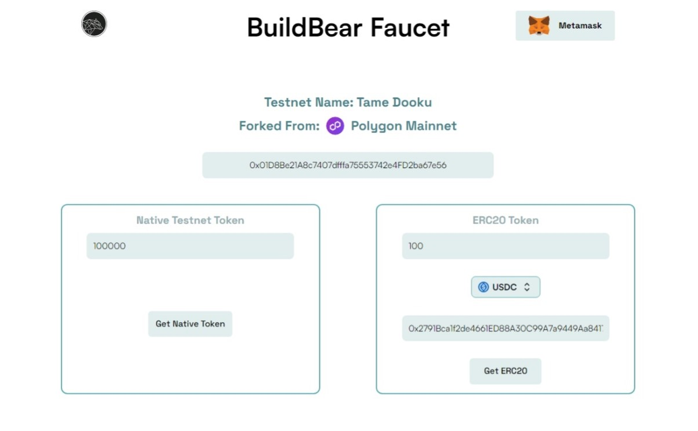
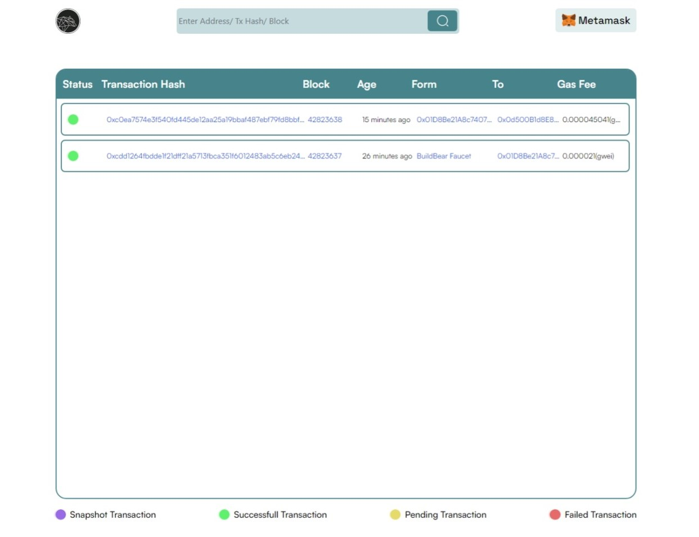

# Hardhat x BuildBear

**Hardhat x BuildBear** lets you create your own private testnet, (optional) forked from the mainnet, with your own Native and ERC20 Token faucet and blockchain Explorer.

# 🐻 Features of Hardhat x [ BuildBear](https://buildbear.io)

## Create your Private Testnet


## Use your personal Native & ERC20 Token Faucet



## Use your personal Explorer with built-in Transaction Trace



# 🏄‍♂️ Quick Start

> 1️⃣ Clone/fork Hardhat x Buildbear:

```bash
git clone https://github.com/BuildBearLabs/Hardhat-BuildBear.git
```

> 2️⃣ Install dependencies 

```bash
cd Hardhat-BuildBear
npm install
```

> 3️⃣ Create your private testnet (forked from the mainnet):

```bash
npm run createTestnet
```

Once the Testnet is live, its RPC, Explorer and Faucet details are added to the `testnet.json` file

> 4️⃣ To Deploy the smart contract

```bash
npx hardhat run scripts/deploy.js
```

> 5️⃣ To Run the Test script `diamondTest.js`

```bash
npx hardhat test
```


# 🔭 Learning Resources 

-  [Getting to know Solidity](https://www.buildbear.io/resources/guides-and-tutorials/Solidity)
-  [Building a Decentralized NFT Marketplace ](https://www.buildbear.io/resources/guides-and-tutorials/Building_a_Decentralized_NFT_Marketplace)
-  [Build your own Decentralized Exchange](https://www.buildbear.io/resources/guides-and-tutorials/Build_your_own_Decentralized_Exchange)
-  [Build Your Own Decentralized Lending Protocol](https://www.buildbear.io/resources/guides-and-tutorials/Build_Your_Own_Decentralized_Lending_Protocol)
-  [Learn and deploy an ERC 1155 smart contract ](https://www.buildbear.io/resources/guides-and-tutorials/Learn_and_deploy_an_ERC_1155_smart_contract)
-  [Learn how to Code a Decentralised Hotel Booking System Smart Contract](https://www.buildbear.io/resources/guides-and-tutorials/Learn_how_to_Code_a_Decentralised_Hotel_Booking_System_Smart_Contract)
-  [Building an NFT Lottery: Step-by-Step Guide for Creating a Smart Contract and Frontend](https://www.buildbear.io/resources/guides-and-tutorials/Building_an_NFT_Lottery)


# 💬 Support Chat

Join the telegram [support chat 💬](https://t.me/Web3_dApp_Developers)
